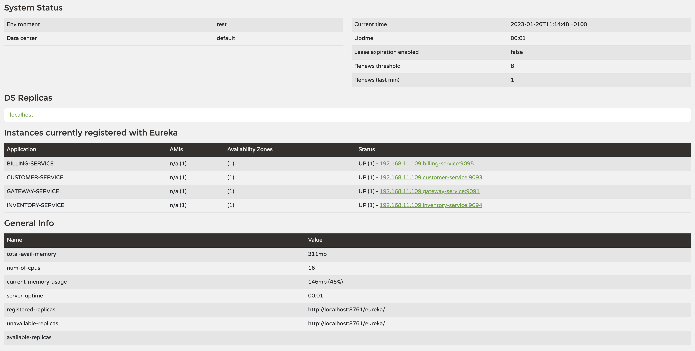

## Documentation des microservices

Les etapes a suivres pour etablire une architecture microservice

### Creation des projects
- Creer les projects (Billing-service, Gateway-service, Customer-service, Inventory-service, Service-discovery)

### Description des projects:

Gateway-service:
  - Un reverse proxy qui permet de transmettre les informations au microservice concerner
Service-discovery:
  - Un microservice qui joue le role d'un annuaire

Billing-service , Customer-service, Inventory-service:
  - Des simples microservices connecter a une service de discovery

### Architecture:

### Configurer le gateway service:
1. Ajouter la dependence
    ```
    <dependency>
        <groupId>org.springframework.cloud</groupId>
        <artifactId>spring-cloud-starter-gateway</artifactId>
    </dependency>
    ```
2. Ajouter le routage static
    ```
   spring:
     cloud:
       gateway:
         routes:
           - id: customer_route
             uri: http://localhost:9093/
             predicates:
               - Path=/customers/**
           - id: inventory_route
             uri: http://localhost:9094/
             predicates:
               - Path=/inventory/**
           - id: billing_route
             uri: http://localhost:9095/
             predicates:
               - Path=/billings/**
   ```
### Configurer le service discovery:
1. Ajouter la dependence
    ```
    <dependency>
        <groupId>org.springframework.cloud</groupId>
        <artifactId>spring-cloud-starter-netflix-eureka-server</artifactId>
    </dependency>
    ```
2. Ajouter l'annotation: `@EnableEurekaServer` dana la class main
3. Ajouter la configuration d'eureka dans le fichier `application.yml` ou `application.properties`
    ```yaml
   spring:
     application:
       name: eureka-server
   
   server:
     port: 9090
   eureka:
     client:
       fetch-registry: false
       register-with-eureka: false
    ```

### Enregistrer les autres microservices dans l'annuaire Eureka
Tout d'abord il faut ajouter un nom pour les microservices `spring.application.name=<NAME-SERVICE>`

1. Ajouter la dependence:
    ```$xml
    <dependency>
         <groupId>org.springframework.cloud</groupId>
         <artifactId>spring-cloud-starter-netflix-eureka-client</artifactId>
    </dependency>    
   ```
2. Annoter la class main avec `@EnableDiscoveryClient`

3. Ajouter la configuration dans le fichier  `application.yml` ou `application.properties`
    ```yaml
   eureka:
     client:
       service-url:
         defaultZone: http://localhost:9090/eureka
   ```

Voila a quoi represente l'annuaire:


### Configurer le routage dynamic
Remplacer les liens dans la configuration de la gateway:
   ```
   spring:
     cloud:
       gateway:
         routes:
           - id: customer_route
             uri: lb://CUSTOMER-SERVICE
             predicates:
               - Path=/customers/**
           - id: inventory_route
             uri: lb://INVENTORY-SERVICE
             predicates:
               - Path=/inventory/**
           - id: billing_route
             uri: lb://BILLING-SERVICE
             predicates:
               - Path=/billings/**
   ```

### Deployer le serveur keycloak
Utiliser le fichier docker-compose pour deployer keycloak facilement
`docker-compose up -d --build` -> `http://localhost:8080`

1. Configurer un nouveau Realm

2. Ajouter un client


3. Tester la generation de token
